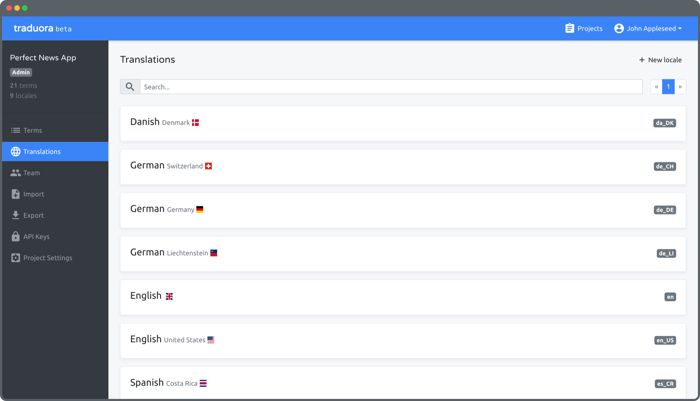

# Traduora

> Traduora is being migrated to a new home at [https://github.com/ever-co/](https://github.com/ever-co/). More details soon in [this thread](https://github.com/traduora/traduora/issues/197).

Traduora is a **translation management platform for teams**. Once you setup your project you can import and export your translations to various formats, work together with your team, instantly deliver translation updates over the air, and *soon* automatically translate your project via third-party integrations.

We want traduora to become the home for managing your translation workflow, that's why we have made all of the core product **open-source** with the intention to grow a **community** and enable developers to build on top of it as a platform.

## Features
- 5 minute setup with Docker, Kubernetes or from source
- Find what you are looking for with instant search
- Invite your team, everyone can work together on the same project
- Automate your translation workflow via our REST API
- Import and export to your favourite formats: JSON flat and nested, CSV, YAML flat and nested, Java Properties, XLIFF 1.2, Gettext (po), Strings, Android Resources (xml).

For more information check out [traduora.com](https://traduora.com), or our docs at [docs.traduora.com](https://docs.traduora.com)

Any missing feature you'd like to see? File an [issue](https://github.com/traduora/traduora/issues) with the feature request to let us know.

## Try it out
Traduora can be run just about anywhere, check out our [quickstart](https://docs.traduora.com/docs/getting-started) for more info.

Also check out traduora's [Docker Hub page](https://hub.docker.com/r/traduora/traduora) for pre-built images.

## Adopters
- Your company/project.

Submit a pull-request to include your company/project into the list.

### Configuration and Deployment
Please check out the [configuration](https://docs.traduora.com/docs/configuration) and [deployment](https://docs.traduora.com/docs/deployment) documents for more information on deploying traduora.

## Frequently Asked Questions
Some questions come up over and over again. Be sure to check out our [FAQ](https://docs.traduora.com/docs/faq) first!

## Security Disclosure
Security is very important to us. If you discover any issue regarding security, please disclose the information responsibly by sending an email to yyaz5d1zm@relay.firefox.com and not by creating a GitHub issue.

## Contributing
We think it's great that you'd like to contribute to traduora. To get started take a look at our [contribution guidelines](https://docs.traduora.com/docs/contributing) for information about our process and where you can fit in!

## Internationalization
Of course we'd like traduora to be available in as many languages as possible. We're setting up a traduora server for translating traduora itself, check back soon for more details on how to contribute.

## Changelog
You can check our [changelog](https://docs.traduora.com/docs/changelog) for information about releases.

## License
See [LICENSE](https://github.com/traduora/traduora/blob/master/LICENSE).

